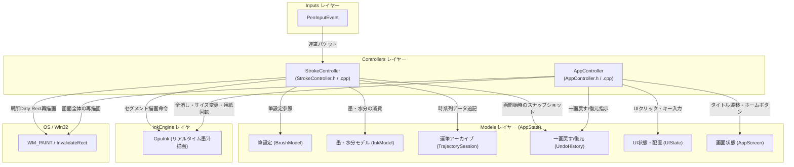

# 制御ロジックレイヤー (Controllers)

本レイヤーは、入力抽象化レイヤーから受け取った正規化ペンイベントやユーザーのGUI操作メッセージを解析し、書道の運筆力学計算・インク消費・状態更新・画面遷移・再描画要求といったビジネスロジックを統括する責務を持ちます。

---

## 1. ファイル構成と関係性

制御層は、運筆の筆跡・物理計算を司る [`StrokeController`](file:///c:/Users/kazuk/デスクトップ/Fudesence/App/FudeCode/Controllers/StrokeController.h) と、UI操作・画面遷移全般（タイトル遷移、パネル操作、文字入力、Undo/Redo、紙だけ表示など）を司る [`AppController`](file:///c:/Users/kazuk/デスクトップ/Fudesence/App/FudeCode/Controllers/AppController.h) の2つで構成されています。

---

## 2. 各プログラムファイルの詳細

### 2.1 [StrokeController.h](file:///c:/Users/kazuk/デスクトップ/Fudesence/App/FudeCode/Controllers/StrokeController.h) / [StrokeController.cpp](file:///c:/Users/kazuk/デスクトップ/Fudesence/App/FudeCode/Controllers/StrokeController.cpp)

- **責務 (Responsibility)**:
  - デバイス非依存の [`PenInputEvent`](file:///c:/Users/kazuk/デスクトップ/Fudesence/App/FudeCode/Inputs/PenInputEvent.h) を受け取り、書道特有の運筆力学計算を実行します。
  - **誤運筆ロックの保護**: 全消しモーダルなどのUIボタン操作直後にペンが接地したままの場合、ペンが一度離れるまで運筆を開始させない（`suppressPenUntilLift`）保護を行います。
  - **筆圧平滑化**: 急激な筆圧変動を抑え、なめらかな筆運びを実現。
  - **筆の硬さ補正**: 筆の硬さ（感度指数）による筆圧カーブ補正。
  - **止め・払いの線幅幾何計算**: ペン先方位角・進行方向ベクトル・運筆速度・仰角（傾き）から、筆の「腹」と「穂先」の接地幾何を計算し、線幅の動的伸縮を決定。
  - **量子化ノイズと角度ジッターの平滑化**: 整数座標格子の丸めによる移動距離の振動を `m_smoothedDist` で吸収し、進行方向ベクトル `(m_smoothedDirX, m_smoothedDirY)` を平滑化することで線の波打ち・コブの発生を防止。
  - **物理消費**: 移動距離と線幅に応じた墨および水分の段階的消費。
  - **記録と描画ディスパッチ**: [`UndoHistory`](file:///c:/Users/kazuk/デスクトップ/Fudesence/App/FudeCode/Models/UndoHistory.h) への一画前控え保存、[`TrajectorySession`](file:///c:/Users/kazuk/デスクトップ/Fudesence/App/FudeCode/Models/TrajectoryModel.h) へのサンプリング点追記、[`GpuInk`](file:///c:/Users/kazuk/デスクトップ/Fudesence/App/FudeCode/InkEngine/GpuInk.h) への線分セグメント投入、および描画負荷を最小限に抑える軸平行境界ボックス（Dirty Rect）による局所再描画要求 (`InvalidateRect`) を行います。
- **入力 (Input)**:
  - `HWND hWnd`: 描画先メインウィンドウ
  - `const PenInputEvent& event`: 正規化されたペン入力情報（座標、筆圧、高度角、方位角、時間など）
  - `AppState& state`: アプリケーション全体のモデル状態
  - `GpuInk& gpuInk`: 墨汁描画エンジンインスタンス
- **出力 (Output)**:
  - `gpuInk.DrawSegmentLinear(seg)`: 補間された運筆線分の描画実行
  - `state.ink.Consume(...)`: 墨残量および水分量の減少
  - `state.trajectory.AddPoint(...)`: 運筆アーカイブの更新
  - `InvalidateRect(hWnd, &rcDirty, FALSE)`: 描画更新領域のOSへの通知
- **使用されている定数の名前 (Constants used)**:
  - `alphaPrs`: 筆圧平滑化係数（加圧時 `0.35`、抜圧時 `0.60`）。
  - `alphaWidth`: 線幅平滑化係数（通常時 `0.25`、線幅減少時 `0.45`、高速移動時 `0.35`）。
  - 最大飛び判定閾値: 移動距離 `dist > 300.0` の場合に別ストロークとしてリセット。
  - 払い減衰補正指数: `angleHaraiPower = 1.3 + (0.2 + 0.3 * absAngleDiff) * (std::min)(m_smoothedDist, 8.0)`。
  - 止め補正係数: `tomeFactor = 1.0 + 0.1 * (1.0 - (std::min)(m_smoothedDist / 3.0, 1.0)) * std::pow(pressureFactor, 0.8)`。
  - インク消費基準定数: `consumeAmount = stepDist * widthRatio * 0.00015`。
  - Dirty Rect パディング: `pad = static_cast<int>(std::ceil(maxWidth * 1.5 + 24.0))`。

---

### 2.2 [AppController.h](file:///c:/Users/kazuk/デスクトップ/Fudesence/App/FudeCode/Controllers/AppController.h) / [AppController.cpp](file:///c:/Users/kazuk/デスクトップ/Fudesence/App/FudeCode/Controllers/AppController.cpp)

- **責務 (Responsibility)**:
  - マウスクリック、ドラッグ、キー入力（お手本文字入力）、ウィンドウサイズ変更など、UI全般のイベントをハンドリングします。
  - **画面遷移制御**:
    - タイトル画面でのタップ/クリック検知によりスタジオ画面への遷移アニメーション（`isTransitioning = true`）を開始。
    - 左上ホームボタン押下によるタイトル画面への復帰。
  - **UIインタラクション**:
    - 左側フローティングパネルの開閉・タブ切り替え（筆・紙・解析・保存・お手本）、筆の硬さスライダー調整、半紙選択、升目選択、カラーテーマ、お手本文字の配置と書体変更。
    - 硯パネルでの墨補充ボタン押下（ペンの筆圧 `penPressure` に応じた補充量制御）、全消しモーダル確認。
  - **一画戻す (Undo) / 一画復元 (Redo)**: [`UndoHistory`](file:///c:/Users/kazuk/デスクトップ/Fudesence/App/FudeCode/Models/UndoHistory.h) を操作し、墨テクスチャ・墨残量・運筆時系列データを過去の状態へ安全に巻き戻し/復元します。
  - **紙を大きくする（横向き）表示の切り替え**: `SetPaperOnly` により、半紙の縦横回転、書いた墨と運筆記録の90度回転引き継ぎ、升目ジオメトリの再配置を統括します。
- **入力 (Input)**:
  - `HWND hWnd`: ウィンドウハンドル
  - `POINT pt`: マウスクリック・移動座標
  - `double penPressure`: ペンで押したときの筆圧（負値はマウス入力）
  - `WPARAM wParam`: 修飾キーまたはメッセージパラメータ
  - `wchar_t ch`: WM_CHAR で受け取る入力文字（IME確定文字）
  - `int width, int height`: クライアント領域の幅と高さ
  - `AppState& state`: 状態モデル
  - `GpuInk& gpuInk`: 墨描画エンジン
- **出力 (Output)**:
  - 戻り値 `bool`: 各操作がUIによって消費されたか（運筆等への透過を防ぐフラグ）
  - `state.ui` / `state.brush` / `state.paper` / `state.otehon` / `state.replay` の各フィールド更新
  - `InvalidateRect(hWnd, NULL, FALSE)`: UI変更に伴う画面全体の再描画要求
- **使用されている定数の名前 (Constants used)**:
  - `LeftTab`: 各タブ識別列挙子。
  - `REPLAY_TIMER_ID`: 運筆リプレイ再生用の Win32 タイマ ID (`101`)。
  - `MAX_GRID_CELLS`: お手本配置マスの最大数 (`8`)。
  - `OTEHON_PALETTE_MAX`: お手本候補タイルの最大数 (`8`)。
