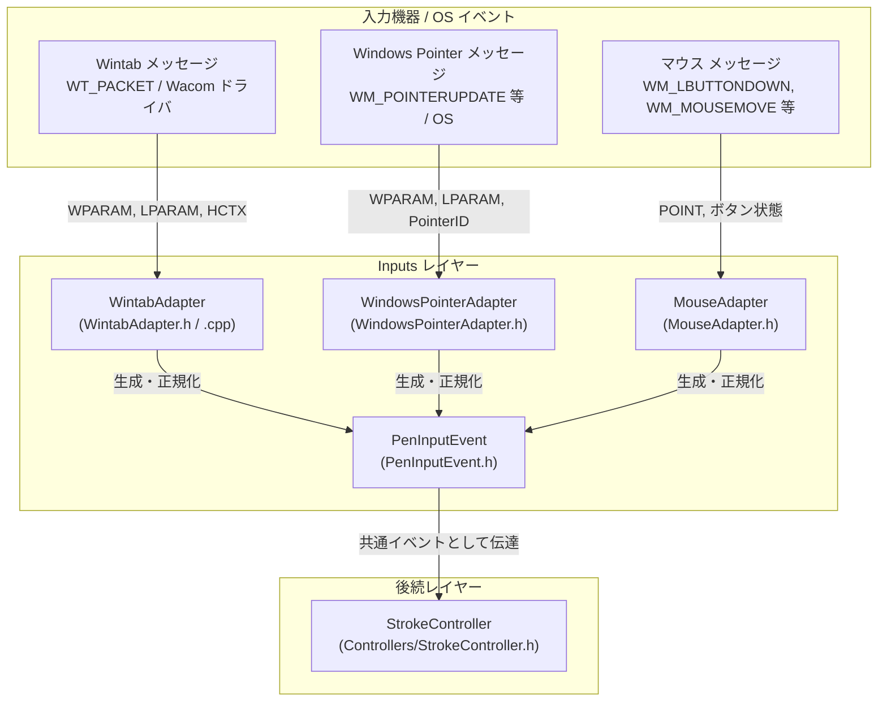

# 入力抽象化レイヤー (Inputs)

本レイヤーは、多種多様な入力デバイス（Wacom製を含むペンタブレット、液晶タブレット、Windows Ink対応ペン、通常のマウス）から送られるプラットフォーム固有の入力メッセージを受け取り、デバイス非依存の共通フォーマットに正規化して後続のコントローラに渡す責務を持ちます。

---

## 1. ファイル構成と関係性

入力層は、デバイス固有のAPIごとにアダプタ（Adapterパターン）を用意し、すべて共通のデータ構造体である [`PenInputEvent`](file:///c:/Users/kazuk/デスクトップ/Fudesence/App/FudeCode/Inputs/PenInputEvent.h) を生成します。

---

## 2. 各プログラムファイルの詳細

### 2.1 [PenInputEvent.h](file:///c:/Users/kazuk/デスクトップ/Fudesence/App/FudeCode/Inputs/PenInputEvent.h)

- **責務 (Responsibility)**:
  - どのようなペンタブレット・液晶ペンタブレット・OSの入力方式であっても、書道シミュレーションに必要な幾何・物理パラメータを統一的に表現するデバイス非依存のデータ構造体 `PenInputEvent` を定義します。
- **入力 (Input)**:
  - なし（純粋なデータ型定義）
- **出力 (Output)**:
  - なし（各アダプタから生成され、コントローラやアーカイブモデルに渡される構造体）
- **使用されている定数の名前 (Constants used)**:
  - `NOMINMAX`: Windows ヘッダーによる `min`/`max` マクロ汚染の防止。
- **保持する主要フィールド**:
  - `x`, `y`: クライアント領域基準の座標 (px)
  - `z`: ペン先とタブレット表面の距離/ホバーZ (0: 接触)
  - `pressure`: 正規化された筆圧 ($0.0 \sim 1.0$)
  - `altitudeDegrees`: 筆先の仰角 ($0.0^\circ$: 水平 $\sim 90.0^\circ$: 垂直)
  - `azimuthRad`: 筆先の方位角 ($0 \sim 2\pi$ ラジアン)
  - `inRange`: ペン先がタブレット検出範囲内にあるかのフラグ
  - `isEraser`: 消しゴム側かペン先側か
  - `time`: タイムスタンプ (ms)

---

### 2.2 [WintabAdapter.h](file:///c:/Users/kazuk/デスクトップ/Fudesence/App/FudeCode/Inputs/WintabAdapter.h) / [WintabAdapter.cpp](file:///c:/Users/kazuk/デスクトップ/Fudesence/App/FudeCode/Inputs/WintabAdapter.cpp)

- **責務 (Responsibility)**:
  - Wacom 製タブレット等の標準インターフェースである Wintab API から発行される `WT_PACKET` メッセージを読み取り、デバイス固有の生データ（`PACKET` 構造体）を [`PenInputEvent`](file:///c:/Users/kazuk/デスクトップ/Fudesence/App/FudeCode/Inputs/PenInputEvent.h) へ変換・正規化します。
  - デバイスごとの最大筆圧（1024, 2048, 8192 等）や画面座標系（タブレット座標系・スクリーン座標系・クライアント座標系）の差分を吸収します。
- **入力 (Input)**:
  - `HWND hWnd`: 対象ウィンドウハンドル
  - `WPARAM wParam`: パケットシリアル番号
  - `LPARAM lParam`: Wintab コンテキストハンドル (`HCTX`)
  - `WintabManager& wintab`: デバイスのコンテキスト・最大筆圧設定を管理するサービスインスタンス
- **出力 (Output)**:
  - `PenInputEvent& outEvent`: 正規化されたペン入力イベント
  - 戻り値 `bool`: パケット取得および変換の成否（成功時 `true`）
- **使用されている定数の名前 (Constants used)**:
  - `NOMINMAX`: マクロ汚染防止。
  - `gpWTPacket`: Wintab32 DLL から動的にロードされたパケット読み出し関数ポインタ。
  - `minThreshold`: 微弱なノイズ筆圧の足切り閾値（通常 `0` または `maxPrs * 0.01`）。

---

### 2.3 [WindowsPointerAdapter.h](file:///c:/Users/kazuk/デスクトップ/Fudesence/App/FudeCode/Inputs/WindowsPointerAdapter.h)

- **責務 (Responsibility)**:
  - Windows 8 / 10 / 11 の標準ポインター入力 API (`WM_POINTERDOWN`, `WM_POINTERUPDATE`, `WM_POINTERUP`) を受け取り、Windows Ink 対応ペンやタッチデジタイザーからの入力を [`PenInputEvent`](file:///c:/Users/kazuk/デスクトップ/Fudesence/App/FudeCode/Inputs/PenInputEvent.h) へ変換します。
  - ポインタータイプが `PT_PEN`（デジタイザーペン）であるか判定し、Windows が提供する $X/Y$ 傾き角（`tiltX`, `tiltY`: $-90^\circ \sim +90^\circ$）から三角関数を用いて仰角（altitude）と方位角（azimuth）を正確に数理変換します。
- **入力 (Input)**:
  - `HWND hWnd`: ウィンドウハンドル
  - `UINT message`: Windows メッセージ (`WM_POINTER*`)
  - `WPARAM wParam`: ポインター ID を含むパラメータ (`GET_POINTERID_WPARAM(wParam)`)
  - `LPARAM lParam`: 座標パラメータ
- **出力 (Output)**:
  - `PenInputEvent& outEvent`: 正規化されたペン入力イベント
  - 戻り値 `bool`: ペン入力として正常に変換されたか（タッチや通常マウスの場合は `false`）
- **使用されている定数の名前 (Constants used)**:
  - `PT_PEN`: ポインター種別がペンであることを表す定数。
  - `POINTER_FLAG_INCONTACT`: ペン先が画面に接触していることを表すフラグ。
  - `POINTER_FLAG_INRANGE`: ペン先がホバー検知圏内にあることを表すフラグ。
  - `PEN_FLAG_ERASER`: ペンのテール側（消しゴム）が使われていることを表すフラグ。
  - 筆圧最大値: Windows Pointer API の標準上限である `1024.0`。

---

### 2.4 [MouseAdapter.h](file:///c:/Users/kazuk/デスクトップ/Fudesence/App/FudeCode/Inputs/MouseAdapter.h)

- **責務 (Responsibility)**:
  - ペンタブレットが接続されていない環境や、デバッグ時・通常マウス操作時のフォールバックとして、標準マウスメッセージ（`WM_LBUTTONDOWN`, `WM_MOUSEMOVE`, `WM_LBUTTONUP`）から擬似的な [`PenInputEvent`](file:///c:/Users/kazuk/デスクトップ/Fudesence/App/FudeCode/Inputs/PenInputEvent.h) を生成します。
- **入力 (Input)**:
  - `POINT pt`: マウスカーソルのクライアント座標
  - `bool isDown`: 左マウスボタンが押下されているか
  - `DWORD time`: タイムスタンプ（省略時は `GetTickCount()`）
- **出力 (Output)**:
  - 戻り値 `PenInputEvent`: 擬似ペン入力イベント（押下時は筆圧 `0.5`、高度角 `90.0` 度（垂直）として生成）
- **使用されている定数の名前 (Constants used)**:
  - `NOMINMAX`: マクロ汚染防止。
  - マウス押下時標準筆圧値: `0.5`。
  - 垂直高度角: `90.0`。
