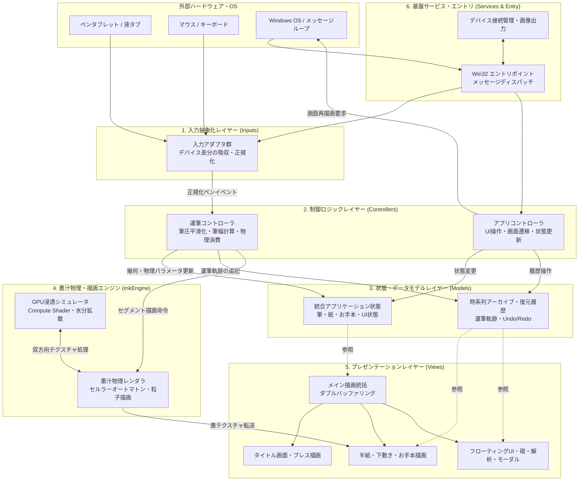
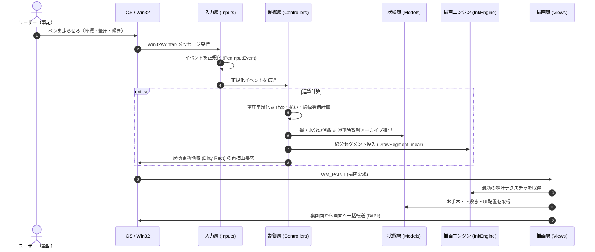

# Fude Sense アーキテクチャ解説

本書は、デジタル習字・書道制作ワークスペース「[**Fude Sense**](file:///c:/Users/kazuk/デスクトップ/Fudesence/README.md)」のソフトウェア構造およびプログラム全体の設計を解説するドキュメントです。

---

## 1. システムの全体像と目的

本システムは、ペンタブレットや液晶タブレットの繊細な筆圧・傾き・方位角データをミリ秒単位で捉え、毛筆特有の「とめ・はね・はらい」、墨汁のリアルタイム浸透・物理にじみ、ならびにカスレ（渇筆）を高精度に再現するリアルタイム書道シミュレーション環境です。

全体の構造は、責務の分離とリアルタイム性能（低遅延描画）を両立するため、**6つの大分類（レイヤー）** に分割して構築されています。

---

## 2. アーキテクチャの6大分類

本プロジェクトは以下の6つのレイヤーから構成されています。各レイヤーの具体的なファイル構成、クラス間の相互作用、入出力、および使用定数については各詳細ドキュメントを参照してください。

### ① [入力抽象化レイヤー (Inputs)](./inputs.md)
- **役割**: ペンタブレットの規格差（Wintab API、Windows Pointer API）や通常のマウス入力を統一的に扱い、座標・筆圧・高度角・方位角・接触状態を正規化された単一の入力イベントへと変換します。
- **特徴**: アプリケーションの中核ロジックが特定のデバイスドライバやAPIに依存しない疎結合設計を実現しています。

### ② [制御ロジックレイヤー (Controllers)](./controllers.md)
- **役割**: 正規化されたペン入力やユーザーのUI操作を受け取り、ビジネスロジックを実行します。
- **特徴**: 
  - **運筆制御**: 筆圧のスムージング、筆の硬さ補正、ペンの傾き・移動方向に応じた「とめ・はらい」の線幅計算、運筆によるインク消費の算出を行い、描画エンジンへ伝達します。
  - **アプリ制御**: タイトル画面と制作ワークスペースの遷移、パネル開閉、筆・紙の変更、全消し、一画戻す/復元（Undo/Redo）、紙を大きくする（横向き）表示（F9）などを統括します。

### ③ [状態・データモデルレイヤー (Models)](./models.md)
- **役割**: アプリケーションが保持するすべてのデータ、設定値、履歴、時系列アーカイブを管理します。
- **特徴**: 
  - 画面状態（タイトル/スタジオ）、筆（太さ・硬さ）、用紙（半紙、向き）、お手本、下敷き格子の状態を集中管理。
  - 書道運筆のミリ秒単位の物理・幾何学パラメータを保持する時系列アーカイブ（JSON/CSVエクスポート対応）。
  - 破壊的な墨汁浸透描画に対応したメモリ効率の良い RLE 圧縮 Undo/Redo 履歴システム。

### ④ [墨汁物理・描画エンジンレイヤー (InkEngine)](./ink_engine.md)
- **役割**: Direct2D および Direct3D 11 Compute Shader を活用し、和紙（半紙）特有の毛細管現象による墨汁の浸透、水分拡散、繊維に沿ったにじみ、ならびに高速運筆時のかすれ（渇筆）をリアルタイムに物理シミュレーションします。
- **特徴**: Direct3D 11 Compute Shader による並列セルラーオートマトン計算と、Direct2D 1.1 (DirectX Interop) による VRAM 内ゼロコピー共有テクスチャ描画により、CPUリードバックを排除した極小レイテンシの筆追従性を実現しています。また、和紙への描画には `SRCAND` による乗算合成を用い、アンチエイリアス境界の白縁取りを防止しています。

### ⑤ [プレゼンテーションレイヤー (Views)](./views.md)
- **役割**: アプリケーションの視覚的表現を担います。
- **特徴**: 
  - メインウィンドウのチラツキを排除するダブルバッファリング描画統括。
  - タイトル画面のエントランスロゴと優美なブレスアニメーション。
  - 半紙の繊維感、下敷き（毛氈）の升目罫線、薄墨のお手本ガイドの合成描画。
  - 和風の文机背景、浮動メニュー、墨残量を可視化する硯（すずり）、リアルタイム運筆解析グラフ・3D筆姿勢モニタなどの各種ウィジェット描画。

### ⑥ [基盤サービス & アプリケーションエントリ (Services & Entry)](./services_and_entry.md)
- **役割**: Windows OS との対話、ウィンドウ生成、メッセージループのハンドリング、Wintab デバイスコンテキストの管理、および作品画像のファイル保存（PNG/BMP）やクリップボード転送を担当します。
- **特徴**: Win32 ネイティブの低遅延イベントディスパッチと、保存失敗時のクリーンアップ・通知を含む外部連携のカプセル化を提供します。

---

## 3. レイヤー間の主要データフロー

本システムにおける代表的な処理サイクルは以下の通りです。

詳細な各レイヤーの構造と内部ファイルについては、各詳細ドキュメントへ進んでください。
