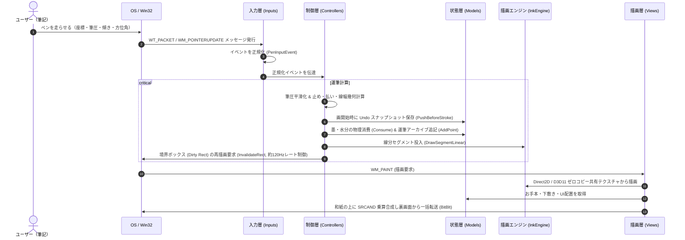

# Fude Sense アーキテクチャ解説

本書は、デジタル習字・書道制作ワークスペース「[**Fude Sense**](file:///c:/Users/kazuk/デスクトップ/Fudesence/README.md)」のソフトウェア構造およびプログラム全体の設計を解説するドキュメントです。

---

## 1. システムの全体像と目的

本システムは、ペンタブレットや液晶タブレットの繊細な筆圧・傾き・方位角データをミリ秒単位で捉え、毛筆特有の「とめ・はね・はらい」、墨汁のリアルタイム浸透・物理にじみ、ならびにカスレ（渇筆）を高精度に再現するリアルタイム書道シミュレーション環境です。

描画パイプラインには、Direct3D 11 Compute Shader と Direct2D 1.1 の DirectX Interop による**GPU VRAM 内ゼロコピー描画**を採用し、毎フレームの GPU ↔ CPU 往復転送を完全撤廃することで、極めて低遅延なリアルタイム運筆レスポンスを実現しています。また、半紙への墨汁描画に `SRCAND` ラスタオペレーション（乗算合成）を適用することで、アンチエイリアス境界の白色縁取りを排除し、和紙の地色に自然に墨が染み込む表現を可能にしています。

全体の構造は、責務の分離とリアルタイム性能（低遅延描画）を両立するため、**6つの大分類（レイヤー）** に分割して構築されています。

```mermaid
graph TD
    subgraph DeviceLayer ["外部ハードウェア・OS"]
        DevPen[ペンタブレット / 液タブ]
        DevMouse[マウス / キーボード]
        DevOS[Windows OS / メッセージループ]
    end

    subgraph Layer1 ["1. 入力抽象化レイヤー (Inputs)"]
        Inputs[入力アダプタ群<br>Wintab / Pointer / Mouse<br>デバイス差分の吸収・正規化]
    end

    subgraph Layer2 ["2. 制御ロジックレイヤー (Controllers)"]
        StrokeCtrl[運筆コントローラ<br>筆圧平滑化・線幅幾何・物理インク消費]
        AppCtrl[アプリコントローラ<br>UI操作・画面遷移・Undo/Redo・アーカイブ操作]
    end

    subgraph Layer3 ["3. 状態・データモデルレイヤー (Models)"]
        AppState[統合アプリケーション状態ファサード<br>筆・紙・お手本・UI状態・リプレイ]
        Archive[時系列アーカイブ・復元履歴<br>運筆軌跡・外部読込・Undo/Redo]
    end

    subgraph Layer4 ["4. 墨汁物理・描画エンジン (InkEngine)"]
        GpuSim[GPU浸透シミュレータ<br>Direct3D 11 Compute Shader]
        InkEngine[墨汁物理レンダラ (GpuInk)<br>Direct2D 1.1 共有ビットマップ<br>セルラーオートマトン浸透計算]
        ReplayEngine[リプレイ墨汁エンジン (ReplayInk)<br>チェックポイント高速シーク]
    end

    subgraph Layer5 ["5. プレゼンテーションレイヤー (Views)"]
        MainView[メイン描画統括<br>ダブルバッファリング・局所高速パス]
        TitleView[タイトル画面・ブレス描画]
        CanvasView[半紙・下敷き・お手本・墨・3D筆・芯線軌跡描画]
        UIViews[フローティングUI・硯・解析・モーダル]
    end

    subgraph Layer6 ["6. 基盤サービス・エントリ (Services & Entry)"]
        AppEntry[Win32 エントリポイント<br>メッセージディスパッチ・ショートカット]
        SysServices[Wintabデバイス管理・画像出力 (WIC PNG/BMP)]
    end

    DevPen --> Inputs
    DevMouse --> Inputs
    DevOS --> AppEntry
    AppEntry --> Inputs
    AppEntry --> AppCtrl

    Inputs -->|正規化ペンイベント (PenInputEvent)| StrokeCtrl
    StrokeCtrl -->|幾何・物理パラメータ更新| AppState
    StrokeCtrl -->|運筆軌跡の追記| Archive
    StrokeCtrl -->|セグメント描画命令| InkEngine
    StrokeCtrl -->|局所Dirty Rect更新要求| DevOS

    AppCtrl -->|状態変更・モード切替| AppState
    AppCtrl -->|履歴巻き戻し・外部アーカイブ読込| Archive
    AppCtrl -->|全消し・リサイズ・回転| InkEngine
    AppCtrl -->|画面再描画要求| DevOS

    GpuSim <-->|DirectX Interop ゼロコピー共有| InkEngine
    Archive -->|運筆パラメータ供給| ReplayEngine

    AppState -.->|参照| MainView
    Archive -.->|参照| CanvasView
    Archive -.->|参照| UIViews
    InkEngine -->|墨テクスチャ転送 (SRCAND)| CanvasView
    ReplayEngine -->|再生墨テクスチャ| CanvasView

    MainView --> TitleView
    MainView --> CanvasView
    MainView --> UIViews
    SysServices <--> AppEntry
```

---

## 2. アーキテクチャの6大分類

本プロジェクトは以下の6つのレイヤーから構成されています。各レイヤーの具体的なファイル構成、クラス間の相互作用、入出力、および使用定数については各詳細ドキュメントを参照してください。

### ① [入力抽象化レイヤー (Inputs)](file:///c:/Users/kazuk/デスクトップ/Fudesence/learn/inputs.md)
- **役割**: ペンタブレットの規格差（Wacom製などの Wintab API、Windows Pointer API）や通常のマウス入力を統一的に扱い、座標・筆圧・高度角・方位角・接触状態を正規化された単一の入力イベント（[`PenInputEvent`](file:///c:/Users/kazuk/デスクトップ/Fudesence/App/FudeCode/Inputs/PenInputEvent.h)）へと変換します。
- **特徴**: アプリケーションの中核ロジックが特定のデバイスドライバやAPIに依存しない疎結合設計を実現しています。

### ② [制御ロジックレイヤー (Controllers)](file:///c:/Users/kazuk/デスクトップ/Fudesence/learn/controllers.md)
- **役割**: 正規化されたペン入力やユーザーのUI操作を受け取り、ビジネスロジックを実行します。
- **特徴**: 
  - **運筆制御 ([`StrokeController`](file:///c:/Users/kazuk/デスクトップ/Fudesence/App/FudeCode/Controllers/StrokeController.h))**: 筆圧のスムージング、筆の硬さ補正、ペンの傾き・進行方向に応じた「とめ・はらい」の動的線幅計算、運筆に伴う物理インク消費（満タンで書ける距離のスケール補正および乾き具合連動）、描画エンジンへの線分投入、ならびに軸平行境界ボックス（Dirty Rect）による局所再描画レート制御（約120Hz/8ms）を統括します。
  - **アプリ制御 ([`AppController`](file:///c:/Users/kazuk/デスクトップ/Fudesence/App/FudeCode/Controllers/AppController.h))**: タイトル画面とスタジオ画面の遷移、フローティングパネル操作、筆・紙設定変更、全消し、一画戻す/復元（Undo/Redo）、紙を大きくする（横向き）表示（F9）、他者の運筆アーカイブのインポート解析、お手本の IME 日本語入力追従などを統括します。

### ③ [状態・データモデルレイヤー (Models)](file:///c:/Users/kazuk/デスクトップ/Fudesence/learn/models.md)
- **役割**: アプリケーションが保持するすべてのデータ、設定値、履歴、時系列アーカイブを管理します。
- **特徴**: 
  - 統合ファサード [`AppState`](file:///c:/Users/kazuk/デスクトップ/Fudesence/App/FudeCode/Models/AppState.h) により、画面状態、筆・紙・お手本・UI配置ジオメトリを一元管理。
  - 運筆の全サンプリング点を保持する時系列アーカイブ [`TrajectorySession`](file:///c:/Users/kazuk/デスクトップ/Fudesence/App/FudeCode/Models/TrajectoryModel.h)（JSON/CSVエクスポート・インポート対応、リビジョン整合性管理）。
  - 破壊的墨汁描画に対応した RLE 圧縮履歴 [`UndoHistory`](file:///c:/Users/kazuk/デスクトップ/Fudesence/App/FudeCode/Models/UndoHistory.h)（メモリ上限384MB、紙を大きくする表示の出入り時における90度回転追従保持、終筆保護同期）。

### ④ [墨汁物理・描画エンジンレイヤー (InkEngine)](file:///c:/Users/kazuk/デスクトップ/Fudesence/learn/ink_engine.md)
- **役割**: Direct2D および Direct3D 11 Compute Shader を活用し、和紙（半紙）特有の毛細管現象による墨汁の浸透、水分拡散、繊維に沿ったにじみ、ならびに高速運筆時のかすれ（渇筆）をリアルタイムに物理シミュレーションします。
- **特徴**: Direct3D 11 テクスチャから Direct2D 1.1 の `ID2D1Bitmap1` を共有する**ゼロコピー描画**により、PCIe バス帯域の浪費を排除。単一パラメータ墨残量モデル [`InkModel`](file:///c:/Users/kazuk/デスクトップ/Fudesence/App/FudeCode/InkEngine/InkModel.h) によるリアルタイムカスレ駆動、およびチェックポイント方式による高速シーク可能な運筆リプレイエンジン [`ReplayInk`](file:///c:/Users/kazuk/デスクトップ/Fudesence/App/FudeCode/InkEngine/ReplayInk.h) を備えます。

### ⑤ [プレゼンテーションレイヤー (Views)](file:///c:/Users/kazuk/デスクトップ/Fudesence/learn/views.md)
- **役割**: アプリケーションの視覚的表現を担います。
- **特徴**: 
  - チラツキのないダブルバッファリングと運筆中の半紙専用高速局所描画パス（[`MainView`](file:///c:/Users/kazuk/デスクトップ/Fudesence/App/FudeCode/Views/MainView.h)）。
  - タイトル画面の WIC ロゴ表示とブレスアニメーション（[`TitleView`](file:///c:/Users/kazuk/デスクトップ/Fudesence/App/FudeCode/Views/TitleView.h)）。
  - 和紙の質感、薄墨お手本、下敷き升目格子、`SRCAND` 墨汁合成、3D筆姿勢モニタ、運筆リプレイ時の淡墨ゴーストおよび朱色芯線軌跡描画（[`CanvasView`](file:///c:/Users/kazuk/デスクトップ/Fudesence/App/FudeCode/Views/CanvasView.h)）。
  - 文机背景、開閉式フローティングパネル、動的スケール硯パネル、リアルタイム運筆解析グラフ、全消し確認モーダル（回転描画対応）。

### ⑥ [基盤サービス & アプリケーションエントリ (Services & Entry)](file:///c:/Users/kazuk/デスクトップ/Fudesence/learn/services_and_entry.md)
- **役割**: Windows OS との対話、ウィンドウ生成、メッセージループのハンドリング、Wintab デバイスコンテキストの動的ロード・管理、作品画像の高画質エクスポート（WIC PNG / BMP）およびクリップボード連携（`CF_BITMAP`）を担当します。
- **特徴**: Win32 ネイティブの低遅延イベントディスパッチ、各種ショートカット（F11 全画面、F9 紙を大きくする表示、Ctrl+Z/Ctrl+Y 一画戻す/復元、Esc 全消し確認）、保存失敗時の壊れたファイル自動削除クリーンアップを提供します。

---

## 3. レイヤー間の主要データフロー

本システムにおける代表的な処理サイクルは以下の通りです。



詳細な各レイヤーの構造と内部ファイルについては、各詳細ドキュメントへ進んでください。
