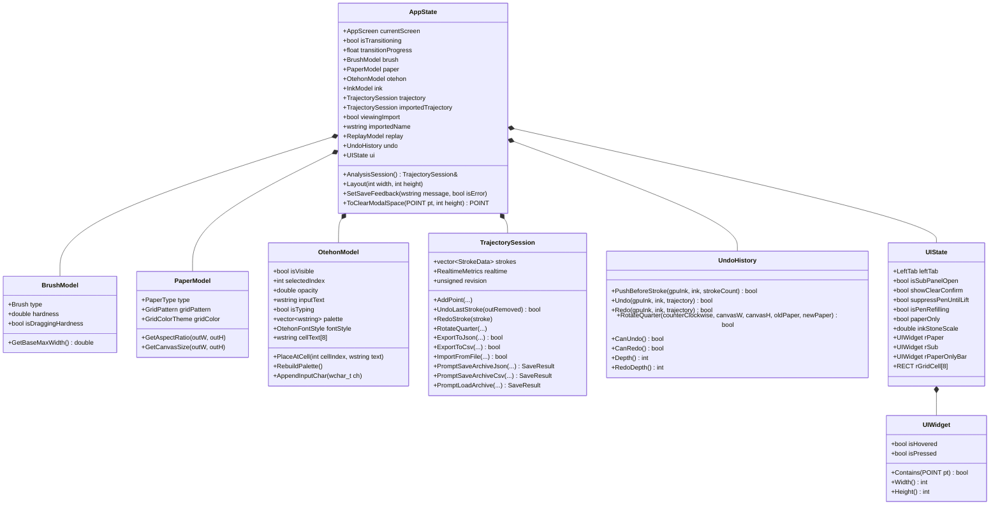

# 状態・データモデルレイヤー (Models)

本レイヤーは、Fude Sense のすべての画面状態・設定パラメータ、書道の運筆時系列アーカイブ、および破壊的レンダリングに対応した一画取り消し/復元（Undo/Redo）履歴を一元管理する責務を持ちます。

---

## 1. ファイル構成と関係性

中心となる [`AppState`](file:///c:/Users/kazuk/デスクトップ/Fudesence/App/FudeCode/Models/AppState.h) はファサード（Facade）パターンとして設計されており、サブモデル群を統括して保持しています。

---

## 2. 各プログラムファイルの詳細

### 2.1 [AppEnums.h](file:///c:/Users/kazuk/デスクトップ/Fudesence/App/FudeCode/Models/AppEnums.h)

- **責務 (Responsibility)**:
  - アプリケーション全体で共有される列挙型、表示文字列変換関数、共通定数を定義します。
- **入力 (Input)**:
  - なし（型定義ヘッダー）
- **出力 (Output)**:
  - なし
- **定義されている主要な列挙型**:
  - `Brush`: 筆の太さ（`Small`: 小筆 基準幅16px, `Medium`: 中筆 基準幅36px, `Large`: 大筆 基準幅56px）
  - `PaperType`: 半紙の実寸比率（`Hanshi`: 242×333mm, 縦横比 1:1.376）
  - `GridPattern`: 下敷き升目格子（`None`: なし, `Cross1`: 1字十字, `Div2`: 2文字上下2段, `Grid4`: 4文字田の字, `Grid6`: 6文字2x3, `Grid8`: 8文字2x4）
  - `OtehonFontStyle`: お手本の書体（`Seikaisho`: 毛筆楷書, `Kyokasho`: 教科書体, `Gyosho`: 行書）
  - `GridColorTheme`: 罫線配色（`RedLine`: 朱赤線 `RGB(235, 85, 85)`, `WhiteLine`: 高級毛氈白線 `RGB(240, 244, 252)`, `InkGray`: 薄墨点線 `RGB(150, 155, 168)`）
  - `AppScreen`: 画面状態（`Title`: タイトル・モード選択画面, `Studio`: 習字制作ワークスペース）
  - `TbButton`: ナビゲーションボタン（`None`, `Home`, `NavToggle`, `Brush`, `Paper`, `Analysis`, `Save`, `Otehon`, `InkRefill`, `ClearAll`）
  - `LeftTab`: 左側パネルタブ（`Brush`, `Paper`, `Analysis`, `Save`, `Otehon`）
- **使用されている定数の名前 (Constants used)**:
  - `GRID_PATTERN_COUNT`: 下敷きパターン数 (`6`)。
  - `OTEHON_FONT_COUNT`: お手本フォントのバリエーション数 (`3`)。
  - `INK_MAX_VALUE`: 墨残量の最大値 (`1.0`)。
  - `MAX_GRID_CELLS`: 升目セル配列の上限 (`8`)。
  - `REPLAY_TIMER_ID`: リプレイ再生用タイマ ID (`101`)。
  - `TRANSITION_TIMER_ID`: タイトル→スタジオ画面遷移タイマ ID (`102`)。
  - `TITLE_ANIM_TIMER_ID`: タイトル画面ブレスアニメーション用タイマ ID (`103`)。

---

### 2.2 [AppState.h](file:///c:/Users/kazuk/デスクトップ/Fudesence/App/FudeCode/Models/AppState.h) / [AppState.cpp](file:///c:/Users/kazuk/デスクトップ/Fudesence/App/FudeCode/Models/AppState.cpp)

- **責務 (Responsibility)**:
  - システム全体の中心となる状態ファサードクラス `AppState`、および筆・紙・お手本・UIのサブモデルを定義・管理します。
  - **画面状態とアニメーション遷移**: 起動時のタイトル画面（`AppScreen::Title`）から制作画面（`AppScreen::Studio`）への滑らかなアルファブレンド遷移（`transitionProgress`, `transitionDurationMs = 400`）の状態を保持します。
  - **動的レイアウト計算**: `Layout(int clientWidth, int clientHeight)` により、ウィンドウサイズや「紙を大きくする（横向き）」モード（`paperOnly`）に応じて、半紙領域（`rPaper`）、左メニュー、右側硯パネル、下敷き升目セル（`rGridCell`）のジオメトリを一元的に整合性を保って算出します。
  - **下敷きと手本の一元配置ジオメトリ**: `rGridBorder` および `rGridCell[MAX_GRID_CELLS]` を `LayoutGridGeometry()` で一括計算し、罫線描画（`CanvasView::DrawGrid`）とお手本配置・ミニマップが1pxの狂いもなく正確に一致する設計としています。
  - **お手本パレット管理**: IME入力された文字列からサロゲートペアを考慮して1文字単位の候補タイル（`palette`）を再構築し、升目ミニマップからの配置（`PlaceAtCell`）を管理します（同じ字が置かれているマスを再指定すると消去するトグル動作）。
  - **他者アーカイブの解析サポート**: `importedTrajectory`, `viewingImport`, `importedName` を保持し、`AnalysisSession()` ゲッターにより自分の運筆と読み込んだアーカイブを透過的に切り替えます。
  - **保存通知とエラーハンドリング**: `SetSaveFeedback(message, isError)` により、保存成否に応じたフィードバック文言と表示時間、エラー表示フラグ（`saveFeedbackIsError`）を管理します。
- **入力 (Input)**:
  - `clientWidth`, `clientHeight`: ウィンドウ描画領域の幅と高さ
  - ユーザー操作による各種パラメータ更新指令
- **出力 (Output)**:
  - 各UIコンポーネントの位置矩形（`UIWidget` / `RECT`）
  - 各種モデルの現在値
- **使用されている定数の名前 (Constants used)**:
  - `TILT_WIDTH_COMPENSATION`: ペン仰角の違いによる線幅変化を旧環境の手応えに合わせる補正係数 (`1.20`)。
  - `BASE_LONG_EDGE`: キャンバスの内部固定論理解像度の長辺基準 (`1200`px)。
  - `OTEHON_PALETTE_MAX`: お手本候補タイルの上限数 (`8`)。
  - 規定のお手本文字群 (`kDefault`): `L"永"`, `L"夢"`, `L"和"`, `L"心"`, `L"道"`, `L"光"`, `L"美"`, `L"桜"`。

---

### 2.3 [TrajectoryModel.h](file:///c:/Users/kazuk/デスクトップ/Fudesence/App/FudeCode/Models/TrajectoryModel.h) / [TrajectoryModel.cpp](file:///c:/Users/kazuk/デスクトップ/Fudesence/App/FudeCode/Models/TrajectoryModel.cpp)

- **責務 (Responsibility)**:
  - 運筆中のすべてのサンプリング点（経過時間、正規化座標、ピクセル座標、筆圧、高度角、方位角、速度、線幅、硬さ補正後筆圧、乾き具合、運筆方向角、墨残量 `inkAmount`）をミリ秒精度で時系列データとして記録・管理します。
  - リアルタイム運筆解析メトリクス（`RealtimeMetrics`）の更新、リプレイ再生進行（`ReplayModel`）、および書道データのエクスポート/インポート（JSON / CSV 形式）を担当します。
  - **リビジョン整合性管理**: 記録が更新されるたびに `BumpRevision()` で通し番号 `m_revision` を進め、リプレイ描画のゴーストキャッシュ（`CanvasView::g_replayCache`）の破棄・再生成を安全に制御します。
  - **90度回転追従**: 紙を大きくする（横向き）表示の出入りに合わせて、記録全画の正規化座標・ピクセル座標・線幅・速度を90度回転（`RotateQuarter`, `RotateStrokeQuarter`）させます。
  - **保存/読み込みダイアログの安全な結果通知**: 操作結果を `enum class SaveResult { Saved, Canceled, Failed }` として返し、ユーザーが保存・読み込みをキャンセルした場合には無駄なエラーを出さず、障害時のみ的確にエラーを通知します。
- **入力 (Input)**:
  - `AddPoint(const PenInputEvent& e, const RECT& rPaper, ...)`: 運筆コントローラからのサンプリング情報
- **出力 (Output)**:
  - `bool ExportToJson(...)` / `bool ExportToCsv(...)`: 全画の時系列データファイル書き出し
  - `bool ImportFromFile(...)`: 外部アーカイブ（JSON / CSV）の読み込み
  - `RealtimeMetrics`: 現在の筆姿勢・速度・ピーク筆圧
- **使用されている定数の名前 (Constants used)**:
  - `ReplayState`: 再生状態列挙値（`Stopped`, `Playing`, `Paused`）。
  - `MAX_HISTORY_POINTS`: リアルタイム波形グラフの表示バッファ上限。

---

### 2.4 [UndoHistory.h](file:///c:/Users/kazuk/デスクトップ/Fudesence/App/FudeCode/Models/UndoHistory.h) / [UndoHistory.cpp](file:///c:/Users/kazuk/デスクトップ/Fudesence/App/FudeCode/Models/UndoHistory.cpp)

- **責務 (Responsibility)**:
  - 墨汁が和紙に浸透・拡散する破壊的描画処理において、「一画戻す (Undo)」および「一画復元 (Redo)」を実現する履歴スタック管理を行います。
  - ストローク開始直前の墨量・水分テクスチャのスナップショット（[`InkSnapshot`](file:///c:/Users/kazuk/デスクトップ/Fudesence/App/FudeCode/InkEngine/InkSnapshot.h)）、墨残量モデル（`InkModel`）、運筆アーカイブの該当ストロークをひとまとめ（`UndoEntry`）として保持します。
  - **紙を大きくする（横向き）表示での回転追従**: 半紙が90度回転した際も、`RotateQuarter` によりすべての履歴スナップショット（`GpuInk::RotateSnapshot`）および復元用ストローク（`TrajectorySession::RotateStrokeQuarter`）を新しい半紙向きに合わせて90度回転させ、履歴を失わずに保持します（回転失敗時のみ安全にクリア）。
- **入力 (Input)**:
  - `PushBeforeStroke(GpuInk& gpuInk, const InkModel& ink, size_t strokeCount)`: 画を書き始める直前の状態保存
  - `Undo(...)` / `Redo(...)`: 取り消し・復元実行指示
- **出力 (Output)**:
  - `GpuInk` / `InkModel` / `TrajectorySession` への過去状態のリストア成否 (`bool`)
- **使用されている定数の名前 (Constants used)**:
  - `UNDO_MAX_STROKES`: 遡れる最大画数 (`30`)。
  - `UNDO_MAX_BYTES`: 32bit (Win32) アドレス空間上限 (2GB) を考慮した履歴メモリ上限 (`384MB`)。

---

### 2.5 [UIComponents.h](file:///c:/Users/kazuk/デスクトップ/Fudesence/App/FudeCode/Models/UIComponents.h)

- **責務 (Responsibility)**:
  - Win32 の基本矩形構造体 `tagRECT` を継承し、コンポーネント指向でヒットテスト（`Contains(POINT)`）やホバー・押下状態を保持できる軽量UI要素 `UIWidget` を定義します。
- **入力 (Input)**:
  - `POINT pt`: カーソル座標
- **出力 (Output)**:
  - `Contains`: 内外判定結果 (`bool`)
  - `Width()`, `Height()`: 矩形寸法
- **使用されている定数の名前 (Constants used)**:
  - `NOMINMAX`: マクロ汚染防止。
