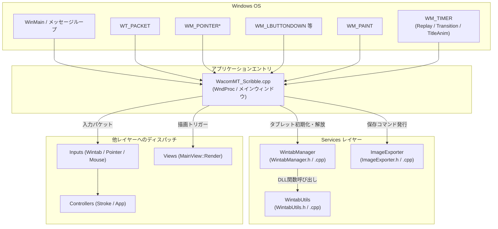

# 基盤サービス & アプリケーションエントリ (Services & Entry)

本レイヤーは、Windows OS との対話、Win32 メインウィンドウの生成とメッセージループ、Wintab デバイスドライバとのコンテキスト接続・管理、ならびに完成した作品の画像保存（BMP / WIC PNG）やクリップボード連携を担うインフラストラクチャ層です。

---

## 1. ファイル構成と関係性

アプリケーションのエントリポイントである [`WacomMT_Scribble.cpp`](file:///c:/Users/kazuk/デスクトップ/Fudesence/App/FudeCode/WacomMT_Scribble.cpp) がOSのメッセージループを駆動し、デバイス管理を [`WintabManager`](file:///c:/Users/kazuk/デスクトップ/Fudesence/App/FudeCode/Services/WintabManager.h) に、画像エクスポートを [`ImageExporter`](file:///c:/Users/kazuk/デスクトップ/Fudesence/App/FudeCode/Services/ImageExporter.h) に委譲します。

---

## 2. 各プログラムファイルの詳細

### 2.1 [WacomMT_Scribble.cpp](file:///c:/Users/kazuk/デスクトップ/Fudesence/App/FudeCode/WacomMT_Scribble.cpp) / [WacomMT_Scribble.h](file:///c:/Users/kazuk/デスクトップ/Fudesence/App/FudeCode/WacomMT_Scribble.h)

- **責務 (Responsibility)**:
  - アプリケーションのエントリポイント（`_tWinMain` / `WinMain`）とメインウィンドウプロシージャ（`WndProc`）を含みます。
  - **メッセージディスパッチ**:
    - `WT_PACKET`: Wintab アダプタ経由で [`StrokeController`](file:///c:/Users/kazuk/デスクトップ/Fudesence/App/FudeCode/Controllers/StrokeController.h) へ転送。
    - `WM_POINTERDOWN` / `WM_POINTERUPDATE` / `WM_POINTERUP`: Windows Pointer アダプタ経由で [`StrokeController`](file:///c:/Users/kazuk/デスクトップ/Fudesence/App/FudeCode/Controllers/StrokeController.h) へ転送。
    - `WM_LBUTTONDOWN` / `WM_MOUSEMOVE` / `WM_LBUTTONUP`: [`AppController`](file:///c:/Users/kazuk/デスクトップ/Fudesence/App/FudeCode/Controllers/AppController.h) またはマウスアダプタへ転送。
    - `WM_CHAR`: お手本文字の入力ハンドリング。
    - `WM_PAINT`: [`MainView::Render`](file:///c:/Users/kazuk/デスクトップ/Fudesence/App/FudeCode/Views/MainView.h) の実行。
    - `WM_SIZE`: レイアウト再計算と描画エンジンのリサイズ。
    - `WM_TIMER`:
      - `REPLAY_TIMER_ID`: 運筆リプレイ再生時刻の進行。
      - `TRANSITION_TIMER_ID`: タイトル画面からスタジオ画面へのアルファブレンド遷移演出の進行。
      - `TITLE_ANIM_TIMER_ID`: タイトル画面でのロゴ・テキストのブレスアニメーション更新。
  - **全画面表示 (F11)**: `ToggleFullscreen` 関数により、モニタ全体へのボーダーレス全画面化と通常ウィンドウ復帰を管理。
  - **紙を大きくする（横向き）表示 (F9)**: メニューを畳んで半紙を横向き最大化表示。
  - **ショートカット制御 (IsStudioAcceptingKeys)**: タイトル画面および画面遷移中は F11 以外の制作キーをブロック。
- **入力 (Input)**:
  - Windows メッセージ（`HWND`, `UINT message`, `WPARAM wParam`, `LPARAM lParam`）
- **出力 (Output)**:
  - `LRESULT`: メッセージ処理結果
- **使用されている定数の名前 (Constants used)**:
  - ウィンドウタイトル: `szTitle = L"Fude Sense"`
  - ウィンドウクラス名: `szWindowClass = L"FUDESENSE"`
  - `REPLAY_TIMER_ID`: リプレイ進行用タイマ識別子 (`101`)。
  - `TRANSITION_TIMER_ID`: 画面遷移用タイマ識別子 (`102`)。
  - `TITLE_ANIM_TIMER_ID`: タイトルブレス用タイマ識別子 (`103`)。

---

### 2.2 [WintabManager.h](file:///c:/Users/kazuk/デスクトップ/Fudesence/App/FudeCode/Services/WintabManager.h) / [WintabManager.cpp](file:///c:/Users/kazuk/デスクトップ/Fudesence/App/FudeCode/Services/WintabManager.cpp)

- **責務 (Responsibility)**:
  - `wintab32.dll` との接続を確立し、ペンタブレットの論理コンテキスト（`HCTX`）のオープン・クローズおよびデバイス特性情報の取得を管理します。
  - デバイスごとの最大筆圧（`maxPressure`）、タブレット物理解像度（`tabletXExt`, `tabletYExt`）、液晶タブレットか板タブレットかの判定を行い、コンテキストマップ（`m_contextMap`）で保持します。
- **入力 (Input)**:
  - `HWND hWnd`: 接続先メインウィンドウハンドル
- **出力 (Output)**:
  - `GetMaxPressure(HCTX hCtx)`: 対象コンテキストの最大筆圧値（フォールバック時 `1024.0`）
  - `GetPrimaryContext()`: プライマリコンテキストハンドル
- **使用されている定数の名前 (Constants used)**:
  - `PACKETDATA`: パケット取得フラグ（`PK_X | PK_Y | PK_Z | PK_BUTTONS | PK_NORMAL_PRESSURE | PK_TANGENT_PRESSURE | PK_TIME | PK_ORIENTATION`）。
  - `PACKETMODE`: ボタンモードフラグ (`PK_BUTTONS`)。

---

### 2.3 [WintabUtils.h](file:///c:/Users/kazuk/デスクトップ/Fudesence/App/FudeCode/Services/WintabUtils.h) / [WintabUtils.cpp](file:///c:/Users/kazuk/デスクトップ/Fudesence/App/FudeCode/Services/WintabUtils.cpp)

- **責務 (Responsibility)**:
  - `wintab32.dll` を動的ロード（`LoadLibraryA`）し、Wintab API の関数ポインタ（`WTInfoA`, `WTOpenA`, `WTPacket`, `WTClose` など）を解決・エクスポートする低レベルユーティリティモジュールです。
  - タブレットドライバがインストールされていない環境でも安全に初期化エラーを検出し、クラッシュを防ぎます。
- **入力 (Input)**:
  - なし（DLLロード関数）
- **出力 (Output)**:
  - 各種グローバル関数ポインタ（`gpWTInfoA`, `gpWTOpenA`, `gpWTPacket` 等）
- **使用されている定数の名前 (Constants used)**:
  - DLL名: `"wintab32.dll"`。

---

### 2.4 [ImageExporter.h](file:///c:/Users/kazuk/デスクトップ/Fudesence/App/FudeCode/Services/ImageExporter.h) / [ImageExporter.cpp](file:///c:/Users/kazuk/デスクトップ/Fudesence/App/FudeCode/Services/ImageExporter.cpp)

- **責務 (Responsibility)**:
  - 半紙上に描かれた墨汁作品を、デスクトップへの画像ファイル保存（高画質 WIC PNG / BMP 形式）またはクリップボードへの転送（DIB 形式）を行う画像エクスポートサービスです。
  - 画面上の縮小表示ではなく、半紙のネイティブ解像度で墨汁テクスチャ、お手本文字、および朱赤の落款印を綺麗に合成して出力します。
  - **保存失敗時のクリーンアップと通知**: 保存処理の途中でディスク容量不足や書き込み失敗が発生した場合、中途半端な壊れたファイルを残さないよう削除（`DeleteFileW`）し、`AppState::SetSaveFeedback` を介してエラー通知フラグを立ててユーザーに明示します。
- **入力 (Input)**:
  - `HWND hWnd`: 親ウィンドウ
  - `GpuInk& gpuInk`: 墨テクスチャ
  - `AppState& state`: 半紙の向き・寸法・お手本設定
  - `bool toClipboard`: クリップボードにコピーするか、ファイル保存するか
- **出力 (Output)**:
  - ファイル出力（デスクトップ上に `Fudesence_YYYYMMDD_HHMMSS.png` または `.bmp`）
  - クリップボードへのビットマップデータ格納
  - 戻り値 `bool`: エクスポート成否
- **使用されている定数の名前 (Constants used)**:
  - `CF_DIB`: Win32 クリップボード形式（Device Independent Bitmap）。
  - `GUID_ContainerFormatPng`: WIC (Windows Imaging Component) の PNG エンコーダー GUID。
