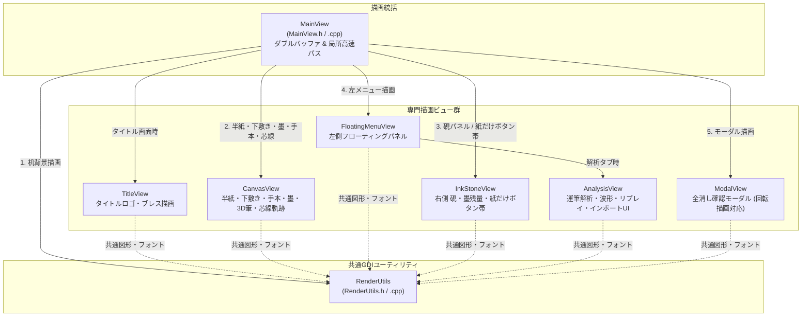

# プレゼンテーションレイヤー (Views)

本レイヤーは、アプリケーションのすべての視覚要素（タイトル画面、文机の木目背景、半紙、下敷き罫線、お手本、墨汁ストローク、UIコントロール、解析グラフ、モーダルダイアログ）の描画を担当するプレゼンテーション層です。

---

## 1. ファイル構成と関係性

中心となる [`MainView`](file:///c:/Users/kazuk/デスクトップ/Fudesence/App/FudeCode/Views/MainView.h) が裏画面（ダブルバッファ）を用意し、各専門ビューを決められた描画順序で呼び出します。共通の描画部品（フォント、角丸矩形、影、テキスト）は [`RenderUtils`](file:///c:/Users/kazuk/デスクトップ/Fudesence/App/FudeCode/Views/RenderUtils.h) に集約されています。

---

## 2. 各プログラムファイルの詳細

### 2.1 [MainView.h](file:///c:/Users/kazuk/デスクトップ/Fudesence/App/FudeCode/Views/MainView.h) / [MainView.cpp](file:///c:/Users/kazuk/デスクトップ/Fudesence/App/FudeCode/Views/MainView.cpp)

- **責務 (Responsibility)**:
  - `WM_PAINT` メッセージを受け取り、ウィンドウ全体の描画を統括します。
  - **ダブルバッファリング**: 画面と同じサイズのメモリDCとビットマップ（`BackBuffer`）を管理し、チラツキ（フリッカー）のない一括転送（`BitBlt`）を実現します。
  - **画面状態とアルファブレンド遷移**:
    - `AppScreen::Title`: タイトル画面（[`TitleView`](file:///c:/Users/kazuk/デスクトップ/Fudesence/App/FudeCode/Views/TitleView.h)）を単独描画。
    - 画面遷移中 (`isTransitioning`): 背景バッファ（スタジオ画面）と一時バッファ（タイトル画面）の間で `AlphaBlend`（`AC_SRC_OVER`）による滑らかなクロスフェード演出を実行。
    - `AppScreen::Studio`: 重ね順（机背景 $\to$ 半紙 $\to$ 墨 $\to$ お手本 $\to$ 下敷き $\to$ 硯/紙だけボタン帯 $\to$ メニュー $\to$ モーダル）を厳密に制御して描画。
  - **局所更新パス（運筆中の半紙専用高速パス）**:
    - 運筆中など半紙専用の局所更新で、モーダルや左メニュー、硯パネルと交差しない場合、背景やUI部品の再描画をスキップし、`rcPaint` 領域のみを画面へ高速転送（CPU/GPU バス帯域を節約）。
- **入力 (Input)**:
  - `HDC hdc`: ウィンドウのデバイスコンテキスト
  - `int width, int height`: ウィンドウ寸法
  - `GpuInk& gpuInk`: 墨汁エンジン
  - `const AppState& state`: アプリケーション状態
  - `const RECT& rcPaint`: 更新領域
- **出力 (Output)**:
  - 画面への最終描画ビットマップ転送
- **使用されている定数の名前 (Constants used)**:
  - `SRCCOPY`: Win32 ラスタオペレーションコード。
  - `AC_SRC_OVER`: アルファブレンド演算コード。

---

### 2.2 [TitleView.h](file:///c:/Users/kazuk/デスクトップ/Fudesence/App/FudeCode/Views/TitleView.h) / [TitleView.cpp](file:///c:/Users/kazuk/デスクトップ/Fudesence/App/FudeCode/Views/TitleView.cpp)

- **責務 (Responsibility)**:
  - アプリ起動時のエントランスである「タイトル画面」を描画します。
  - タイトルロゴ画像（`title_logo.png`）を WIC (Windows Imaging Component) でPremultiplied BGRA としてデコード・ロードし、呼吸（ブレス）のように滑らかに伸縮・明滅するアニメーション効果を表現します。
  - 「タップして硯へ向かう」などの揮毫開始ガイダンスを描画し、画面タップやクリックで習字制作ワークスペースへの遷移を促します。
- **入力 (Input)**:
  - `HDC dc`: 描画DC
  - `int width, int height`: ウィンドウ寸法
  - `const AppState& state`: アプリケーション状態
- **出力 (Output)**:
  - タイトル画面全体のグラフィックス
- **使用されている定数の名前 (Constants used)**:
  - `TITLE_ANIM_TIMER_ID`: ブレスアニメーション用タイマ ID (`103`)。

---

### 2.3 [CanvasView.h](file:///c:/Users/kazuk/デスクトップ/Fudesence/App/FudeCode/Views/CanvasView.h) / [CanvasView.cpp](file:///c:/Users/kazuk/デスクトップ/Fudesence/App/FudeCode/Views/CanvasView.cpp)

- **責務 (Responsibility)**:
  - 書道制作のキャンバス面を描画します。
  - **半紙背景と影**: 繊細な和紙の質感（`Hanshi` 242×333mm 比率）と立体的なドロップシャドウの描画。
  - **墨汁合成**: 通常時は [`GpuInk`](file:///c:/Users/kazuk/デスクトップ/Fudesence/App/FudeCode/InkEngine/GpuInk.h) から転送（DirectX Interop ゼロコピーと `SRCAND` 合成）。
  - **運筆リプレイ描画 ([`DrawReplayCanvas`](file:///c:/Users/kazuk/デスクトップ/Fudesence/App/FudeCode/Views/CanvasView.cpp#L812))**:
    1. **再生済みの墨**: [`ReplayInk`](file:///c:/Users/kazuk/デスクトップ/Fudesence/App/FudeCode/InkEngine/ReplayInk.h) による時系列墨汁再生アニメーション。
    2. **淡墨ゴースト ([`ghostMaster`](file:///c:/Users/kazuk/デスクトップ/Fudesence/App/FudeCode/Views/CanvasView.cpp#L829))**: 実際に書いた文字と100%完全一致する筆圧カラーグラデーション淡墨ゴースト。未再生の未来の文字が筆圧グラデーションとして表示され、再生済みの墨と `SRCAND` 合成（インポート記録時は `importedFullInk` 事前ベイクキャッシュを活用）。
    3. **朱色芯線軌跡 ([`DrawReplayTrajectory`](file:///c:/Users/kazuk/デスクトップ/Fudesence/App/FudeCode/Views/CanvasView.cpp#L857))**: ペンが実際に通過した軌跡（運筆の芯線）を視認しやすい朱色（`RGB(235, 55, 35)`）の細線で時系列に沿って順次描画。
  - **お手本描画 ([`DrawOtehonGlyph`](file:///c:/Users/kazuk/デスクトップ/Fudesence/App/FudeCode/Views/CanvasView.cpp))**: 半紙上の升目セル（emボックス）に内接するようフォントサイズを動的計算し、指定透明度で毛筆楷書・教科書体・行書のお手本を描画（`rotateCcw` による紙だけ表示での90度回転描画対応）。また、`HasOtehonFont` により該当フォントがPCに導入されているかを事前検出。
  - **下敷き格子**: 十字、2段、田の字、2x3、2x4 を指定カラーテーマ（朱赤、白線、薄墨）で描画。
  - **3D筆姿勢モニタ ([`Draw3DBrushPose`](file:///c:/Users/kazuk/デスクトップ/Fudesence/App/FudeCode/Views/CanvasView.cpp))**: 筆先高度角・方位角・接地状態を俯瞰する3D筆を描画。
  - **リソースプール**: `PenPool` により線幅ごとの GDI ペンを再利用し、1画あたり数百個の GDI オブジェクト生成・破棄オーバーヘッドを完全に排除。
- **入力 (Input)**:
  - `HDC dc`, `const AppState& state`, `GpuInk& gpuInk`
- **出力 (Output)**:
  - メモリDC上の半紙領域への描画
- **使用されている定数の名前 (Constants used)**:
  - `SRCAND`: 墨汁およびお手本フォント合成用ラスタオペレーションコード。
  - 芯線カラー: `RGB(235, 55, 35)`。

---

### 2.4 [FloatingMenuView.h](file:///c:/Users/kazuk/デスクトップ/Fudesence/App/FudeCode/Views/FloatingMenuView.h) / [FloatingMenuView.cpp](file:///c:/Users/kazuk/デスクトップ/Fudesence/App/FudeCode/Views/FloatingMenuView.cpp)

- **責務 (Responsibility)**:
  - 画面左側に配置される縦型アイコンツールバーおよび開閉式サブパネルを描画します。
  - タブ（筆・紙・解析・保存・お手本）に応じた設定UIを表示:
    - **筆タブ**: 小筆/中筆/大筆の切り替え、筆の硬さ（感度補正）スライダー（0.1 極軟 ～ 2.0 極硬、状態表示「超極軟」「柔らかめ」「標準」「硬め」）。
    - **紙タブ**: 下敷き升目6種（なし、十字、2段、田の字、2x3、2x4）、カラーテーマ3種（朱赤、白線、薄墨）。
    - **解析タブ**: [`AnalysisView`](file:///c:/Users/kazuk/デスクトップ/Fudesence/App/FudeCode/Views/AnalysisView.h) を埋め込み描画。
    - **保存タブ**: 作品画像保存（PNG）、クリップボードコピー、運筆アーカイブ保存（JSON）、時系列データ出力（CSV）、ストローク/データ点数インジケータ、成否フィードバック（緑/赤）。
    - **手本タブ**: お手本表示ON/OFF、升目ミニマップ配置UI（選択中文字をマスへ配置/消去）、書体切替（楷書/教科書体/行書、未導入フォントは沈めて表示）、書きたい文字入力欄（IME確定文字列、キャレット描画）、候補タイル8枚、透過度（濃淡）スライダー。
  - **ホームボタン**: タイトル画面へ戻る `rTbHomeBtn` の描画。
- **入力 (Input)**:
  - `HDC dc`, `const AppState& state`
- **出力 (Output)**:
  - 左側UI領域への描画
- **使用されている定数の名前 (Constants used)**:
  - `LeftTab`: 各タブ識別列挙子。

---

### 2.5 [InkStoneView.h](file:///c:/Users/kazuk/デスクトップ/Fudesence/App/FudeCode/Views/InkStoneView.h) / [InkStoneView.cpp](file:///c:/Users/kazuk/デスクトップ/Fudesence/App/FudeCode/Views/InkStoneView.cpp)

- **責務 (Responsibility)**:
  - 画面右側に配置される硯（すずり）および墨残量インジケータ、墨補充ボタン、一画戻す（Undo）、一画復元（Redo）、「紙を大きくする（横向き）」切り替えボタン、全消しボタンを描画します。
  - **スケール対応 (`inkStoneScale`)**: 空き領域に合わせて硯パネル全体を動的スケーリング。
  - **モダンピルバッジ**: 硯の真上に「💧 墨残量: ○%」を表示し、20%以下では「⚠️ 墨残量: ○%」として警告赤表示。
  - **リアルな硯表現**: 墨溜まり、液面の光沢ハイライトライン、磨り面の微細な石目テクスチャを描画。
  - **履歴ボタン表示**: 「↩ 一画戻す」「↪ 一画復元」ボタンに現在の遡り可能画数 `(%d)` を表示し、履歴が無いときは無効色で沈めて描画。
  - **紙だけ表示用ボタンバー ([`DrawPaperOnlyBar`](file:///c:/Users/kazuk/デスクトップ/Fudesence/App/FudeCode/Views/InkStoneView.cpp#L164))**: 半紙を横向き最大化した際に、半紙の右側に縦帯で「墨を補充（残り %d%%）」「通常表示に戻る」「筆跡を消す」ボタンを90度回転文字（`DrawRotatedCenter`）で描画。
- **入力 (Input)**:
  - `HDC dc`, `const AppState& state`
- **出力 (Output)**:
  - 右側硯パネル領域への描画
- **使用されている定数の名前 (Constants used)**:
  - `INK_MAX_VALUE`: 墨残量上限値 (`1.0`)。

---

### 2.6 [AnalysisView.h](file:///c:/Users/kazuk/デスクトップ/Fudesence/App/FudeCode/Views/AnalysisView.h) / [AnalysisView.cpp](file:///c:/Users/kazuk/デスクトップ/Fudesence/App/FudeCode/Views/AnalysisView.cpp)

- **責務 (Responsibility)**:
  - 「解析」タブ選択時に左サブパネル内に展開されるリアルタイム書道解析UIを描画します。
  - **インポートバー ([`DrawImportBar`](file:///c:/Users/kazuk/デスクトップ/Fudesence/App/FudeCode/Views/AnalysisView.cpp#L16))**: 外部運筆アーカイブ（JSON / CSV）の読み込みボタン、およびインポート表示中の「↩ 自分の記録に戻る」ボタン。
  - **リプレイコントローラ ([`DrawReplayControls`](file:///c:/Users/kazuk/デスクトップ/Fudesence/App/FudeCode/Views/AnalysisView.cpp#L39))**: 再生/一時停止、前画/次画スキップ、再生速度（0.5x, 1.0x, 2.0x）、シークバー（プログレスバーおよび各画開始目盛り付き）。
  - **メトリクスカード ([`DrawMetricsCard`](file:///c:/Users/kazuk/デスクトップ/Fudesence/App/FudeCode/Views/AnalysisView.cpp))**: ピーク筆圧、平均速度、経過時間を表示。
  - **筆姿勢コンパス ([`DrawTiltCompass`](file:///c:/Users/kazuk/デスクトップ/Fudesence/App/FudeCode/Views/AnalysisView.cpp))**: 筆先の仰角・方位角をコンパス状にグラフィカル表示。
  - **リアルタイム波形グラフ ([`DrawWaveformGraph`](file:///c:/Users/kazuk/デスクトップ/Fudesence/App/FudeCode/Views/AnalysisView.cpp))**: 筆圧および運筆速度の推移をオシロスコープ状に描画（クリック/ドラッグでのシーク操作に対応）。
- **入力 (Input)**:
  - `HDC dc`, `const RECT& rBox`, `const AppState& state`
- **出力 (Output)**:
  - 解析サブパネル領域への描画
- **使用されている定数の名前 (Constants used)**:
  - `ReplayState`: 再生状態列挙値。

---

### 2.7 [ModalView.h](file:///c:/Users/kazuk/デスクトップ/Fudesence/App/FudeCode/Views/ModalView.h) / [ModalView.cpp](file:///c:/Users/kazuk/デスクトップ/Fudesence/App/FudeCode/Views/ModalView.cpp)

- **責務 (Responsibility)**:
  - 「すべて消す」ボタン押下時に、半紙の上に重なる確認モーダルダイアログ（半透明暗転オーバーレイ、メッセージ、確認・キャンセルボタン）を描画します。
  - **紙だけ表示（横向き）での回転描画**: `SetWorldTransform`（`GM_ADVANCED`）を用いて座標系を左回りに90度回転させて描画し、倒した向きで正しく読めるダイアログを展開します。
- **入力 (Input)**:
  - `HDC dc`, `int width, int height`, `const AppState& state`
- **出力 (Output)**:
  - モーダル領域の描画
- **使用されている定数の名前 (Constants used)**:
  - `GM_ADVANCED`: 高度グラフィックスモード。

---

### 2.8 [RenderUtils.h](file:///c:/Users/kazuk/デスクトップ/Fudesence/App/FudeCode/Views/RenderUtils.h) / [RenderUtils.cpp](file:///c:/Users/kazuk/デスクトップ/Fudesence/App/FudeCode/Views/RenderUtils.cpp)

- **責務 (Responsibility)**:
  - Win32 GDI を用いた高品質な描画ユーティリティ関数群を提供します。
  - 角丸枠線付きボックス（`Box`）、ドロップシャドウ（`DrawShadow`）、木目調文机背景（`DrawWoodDesk`）、フォント生成（`CreateCustomFont`）、テキスト配置（`DrawTextCustom`, `Center`）、UIカード描画（`DrawTileCard`, `DrawColorThemeButton`）を実装しています。
  - GDIオブジェクト（`HBRUSH`, `HPEN`, `HFONT`）の作成と解放を確実に管理し、GDIリソースリークを防止します。
- **入力 (Input)**:
  - 描画対象DC、矩形、カラー値（`COLORREF`）、文字列など
- **出力 (Output)**:
  - DCへの基本グラフィックス描画
- **使用されている定数の名前 (Constants used)**:
  - デフォルトフォント名: `L"Yu Gothic UI"`。
  - `FW_NORMAL`, `FW_BOLD`: GDI フォントウェイト定数。
